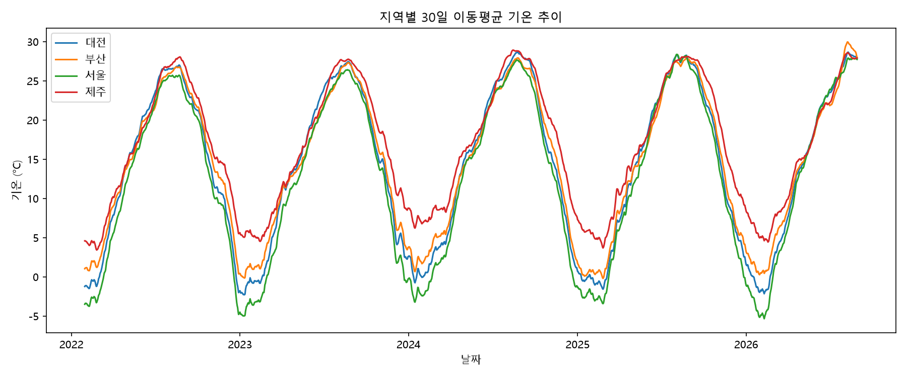
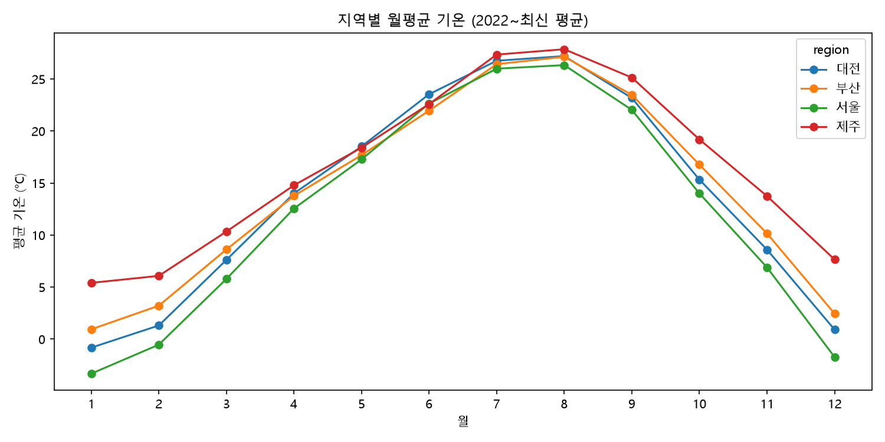
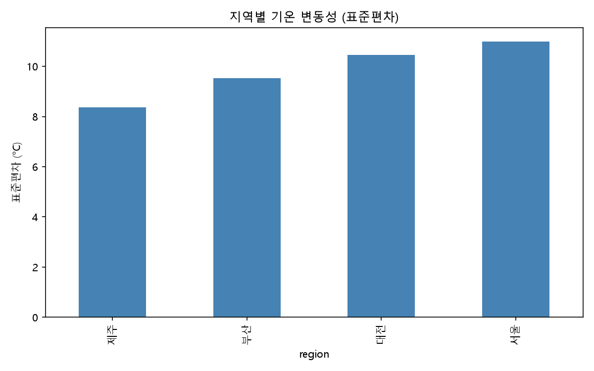
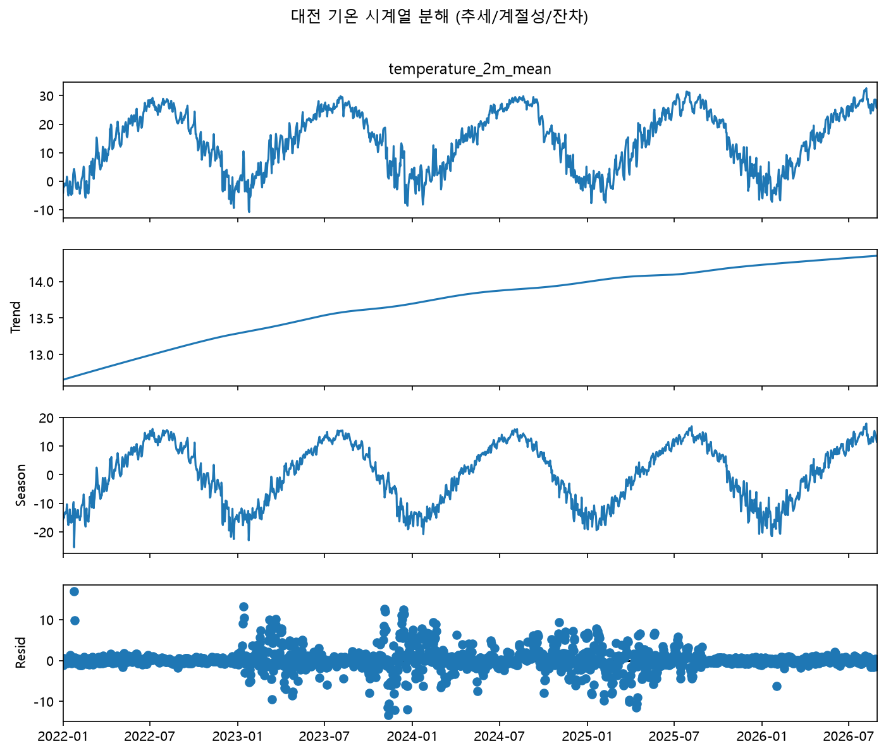

# 지역별 기온 트렌드 분석 리포트

## 1. 분석 주제 및 선정 이유

대전, 서울, 부산, 제주 4개 지역의 일별 기온 데이터를 비교해, 지역별 기후 특성과 시간에 따른 변화 추세를 확인해보고자 함.

## 2. 분석 질문 (질문 ↔ 검증 그림 연결)

| # | 질문 | 검증 그림 |
|---|---|---|
| 1 | 4개 지역 중 기온 변동성(표준편차)이 가장 큰/작은 지역은 어디이며 차이는 얼마인가? | images/03_volatility_by_region.png |
| 2 | 월별로 지역 간 기온 차이가 가장 크게/작게 벌어지는 달은 언제인가? | images/02_monthly_avg_by_region.png |
| 3 | 여름/겨울 기온 피크에 뚜렷한 상승 추세가 있는가? | images/01_region_trend.png, images/04_stl_decomposition.png |

## 3. 데이터 설명

- 출처: Open-Meteo Historical Weather API
- 지역: 대전, 서울, 부산, 제주
- 기간: [자동 계산값 기입] ~ [자동 계산값 기입]
- 데이터 수: 지역당 [N]일, 전체 [4N]행

## 4. 데이터 정제 (처리 기준·방법 명시 필수)

- 결측치: [개수] 개 발견. 처리 방법: [예: 선형 보간(interpolate) 적용 / 해당 행 삭제 등 실제로 한 방법]. 적용 이유: [왜 그 방법을 골랐는지 한 줄]
- 이상치: 판단 기준 [예: 평균 ± 3표준편차를 벗어나는 값]으로 확인한 결과 [개수]개 발견/미발견. 처리: [실제로 한 조치]

## 5. 적용한 시계열 분석 기법 (집계단위 선택 이유 포함)

1. **이동평균 (7일/30일)**: 일별 데이터의 단기 노이즈를 제거하고 계절 주기를 보기 위해 7일(단기)과 30일(중기) 두 창을 함께 사용함. 일 단위 원본은 노이즈가 커서 추세 파악이 어렵고, 월 단위로 바로 집계하면 계절 내 변화(예: 초여름-한여름 차이)를 놓치므로 중간 단계로 30일을 선택함.
2. **월별 집계 및 전월 대비 변화량(변화율)**: 계절성과 단기 변화 속도를 함께 보기 위해 적용.
3. **STL 시계열 분해(추세/계절성/잔차)**: 이동평균만으로는 "진짜 추세"와 "계절 반복"이 섞여 보이므로, 이를 수학적으로 분리해 [지역명]의 장기 추세만 따로 확인함. 분해 결과 추세 성분은 [시작값]°C → [끝값]°C로 변화함.

## 6. 시각화

### 시각화 1: 지역별 30일 이동평균 기온 추이

해석: [이 그래프에서 무엇을 읽었는지 한두 문장]

### 시각화 2: 지역별 월평균 기온

해석: [이 그래프에서 무엇을 읽었는지 한두 문장]

### 시각화 3: 지역별 기온 변동성

해석: [이 그래프에서 무엇을 읽었는지 한두 문장]

### 시각화 4 (추가): [지역명] 트렌드/계절성 분해

해석: [추세 성분이 상승/하락/횡보인지, 계절성 진폭이 얼마인지 한두 문장]

## 7. 인사이트 (관찰에 반드시 실제 수치 포함)

### 인사이트 1
- 관찰(Fact): [generate_report.py 실행 시 출력되는 실제 수치를 그대로 인용]
- 해석(가설): [본인 판단]
- 다음 행동/제안: [본인 판단]

### 인사이트 2
- 관찰(Fact): [실제 수치]
- 해석(가설): [본인 판단]
- 다음 행동/제안: [본인 판단]

### 인사이트 3
- 관찰(Fact): [실제 수치, 특히 STL 트렌드 성분 변화량 활용]
- 해석(가설): [본인 판단]
- 다음 행동/제안: [본인 판단]

## 8. 결론 및 한계점

- 결론(분석 결과 요약): [4~7번 내용을 요약]

### 8-1. AI 도움 없이 본인이 재구성한 결론 (필수, 직접 작성)

> 이 섹션은 위 분석 결과를 보고, **AI와 상의하지 않고 스스로 정리한 결론**을 적는 곳입니다.
> "왜 이런 결과가 나왔다고 생각하는지", "이 분석을 통해 배운 점"을 본인 언어로 자유롭게 서술하세요.
> (이 문단만큼은 AI와의 대화를 그대로 옮기지 마시고, 직접 타이핑해서 채워주세요.)

[여기에 직접 작성]

- 한계점: [데이터 기간 한계, 관측 지점 수 한계 등]
- 다른 조건 적용 시 비교: [예: 기간을 2년으로 줄이거나 집계 단위를 주 단위로 바꾸면 결과가 어떻게 달라지는지 간단히 시도해보고 한 줄 요약]
- 추가로 필요한 데이터: [예: 습도, 풍속, 관측소 고도/위치 메타데이터 등]

## 9. 보너스: 웹 대시보드

- 실행 방법: `streamlit run app.py`
- 지역 / 기간 / 변수 3가지 조건을 조합해 탐색 가능
- [스크린샷 또는 배포 URL]

## 10. AI 사용 로그

| 사용 작업 | 사용 이유 | 검증 방법 |
|---|---|---|
| 데이터 로딩/전처리 코드 작성 | 반복 작업 시간 절감 | 직접 실행해 shape/컬럼명 확인 |
| venv·라이브러리 인식 오류 디버깅 | 에러 원인 파악 시간 절감 | 제안 코드 실행 후 에러 해소 확인 |
| STL 분해·변화율 계산 코드 작성 | 통계 기법 구현 방법 확인 | 직접 실행해 그래프·수치가 합리적인지 확인 |
| 그래프 해석 문장 형식 구성 지원 | 관찰/해석 구분 형식 참고 | 실제 그래프 수치와 대조해 값 교체 |

## 참고 사항

- 데이터 출처: Open-Meteo (CC BY 4.0)
- 실행 방법: README.md 참고
